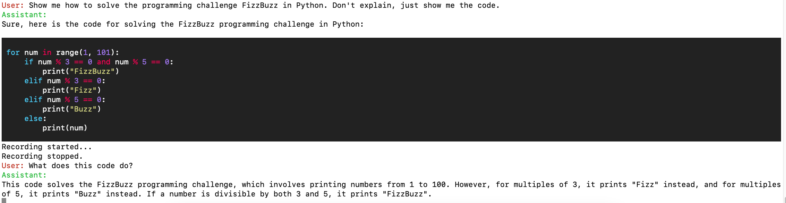

# gpt-voice-assistant
GPT-powered voice assistant in your terminal.
Press a button on your keyboard and speak. GPT will respond in audio. The response will be displayed nicely in the terminal.



Additionally, the voice response will not attempt to read code but will direct you to the terminal instead.

The assistant will keep track of the conversation. You can ask follow-up questions and the assistant will remember the context. However, this will increase costs as each API call will need to include all previous messages. 

Say `clear` to clear the conversation history. The assistant will say "History cleared" and the conversation history will be cleared. This will free up the context and reduce costs.

APIs used:
* OpenAI Whisper for speech-to-text
* AWS Polly for text-to-speech
* OpenAI ChatGPT

All these incur costs. The costs are relatively low.

## Setup

Create an OpenAI account and get an API key. 

Install requirements:

```
pip install -r requirements.txt
```

Create a `.env` file in the `bin/` folder and add the following variables:

```
OPENAI_API_KEY=<your-openai-api-key>
RECORD_KEY=cmd_r
```

RECORD_KEY is the key you want to press to start recording. You can run `python bin/find_key.py` to find the key you want to use.

You will also need to set up AWS credentials. See [here](https://docs.aws.amazon.com/polly/latest/dg/setup-aws-cli.html) for instructions.

